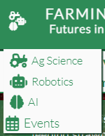
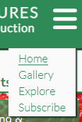
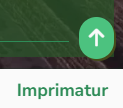
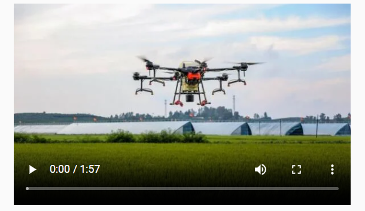
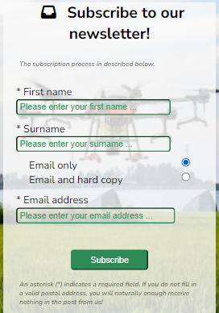
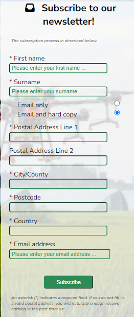
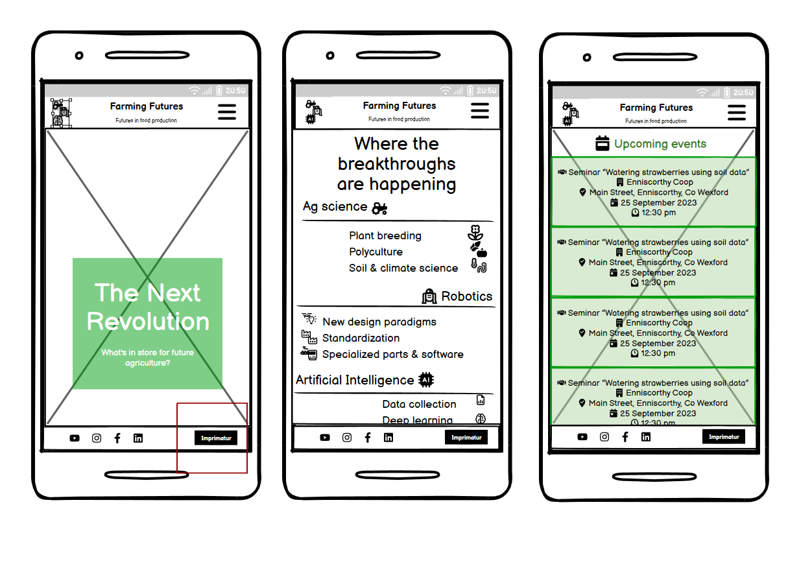
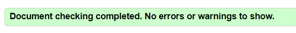
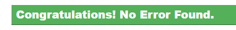
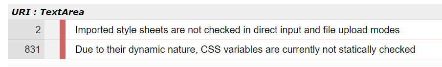

# Farming Futures - An AI- and robotics-inspired site showcasing future changes in agriculture

## Code Institute - First Milestone Project: Create a responsive, user-centred static website.

This website was originally developed to showcase my ability to design and create a static website.

- - -

<!-- TOC start (generated with https://github.com/derlin/bitdowntoc) -->
- [Introduction](#introduction)
- [User experience](#user-experience)
   * [User stories](#user-stories)
- [Structure from the user's point of view](#structure-from-the-users-point-of-view)
   * [Basic initial structure](#basic-initial-structure)
   * [Website pages](#website-pages)
   * [Homepage sections](#homepage-sections)
- [Technical structure (what it looks like under the bonnet)](#technical-structure-what-it-looks-like-under-the-bonnet)
- [Visual styling and properties](#visual-styling-and-properties)
   * [Fonts](#fonts)
   * [Colours](#colours)
   * [Responsiveness](#responsiveness)
   * [Images](#images)
   * [Icons](#icons)
   * [Background images](#background-images)
   * [Other visual details](#other-visual-details)
- [Features](#features)
   * [Navigation](#navigation)
   * [Favicons](#favicons)
   * [Video](#video)
   * [Subscription form](#subscription-form)
- [Development & implementation environment](#development-implementation-environment)
- [Technologies used](#technologies-used)
- [Deployment](#deployment)
- [Design, development & coding philosophy](#design-development-coding-philosophy)
   * [Wireframe](#wireframe)
   * [Sequence of coding steps](#sequence-of-coding-steps)
   * [Commits](#commits)
   * [Minimising code clutter](#minimising-code-clutter)
   * [Comments in code and order of appearance of css selectors on the style.css file](#comments-in-code-and-order-of-appearance-of-css-selectors-on-the-stylecss-file)
   * [Iterative deployment](#iterative-deployment)
- [Testing](#testing)
   * [Iterative testing, validation and troubleshooting -- during ongoing development](#iterative-testing-validation-and-troubleshooting-during-ongoing-development)
   * [Final testing and validation before submission](#final-testing-and-validation-before-submission)
   * [Final validation](#final-validation)
- [Lessons learnt](#lessons-learnt)
   * [Mobile first](#mobile-first)
   * [One-person agile programming](#one-person-agile-programming)
   * [Time management](#time-management)
- [Lessons not (yet) learned](#lessons-not-yet-learned)
- [What doesn't work](#what-doesnt-work)
   * [... because it's outside the scope of project](#-because-its-outside-the-scope-of-project)
   * [... for lack of time, skill and/or data](#-for-lack-of-time-skill-andor-data)
- [Credits and sources](#credits-and-sources)
   * [Code institute's own resources](#code-institutes-own-resources)
   * [External technical and learning resources](#external-technical-and-learning-resources)
   * [Images and video](#images-and-video)
   * [Personal thanks](#personal-thanks)
<!-- TOC end -->
- - -

<!-- TOC -->
## Introduction
This website was prepared for presentation as a first portfolio project for my online course in Full-Stack programming with Code Institute, based in Blackrock, Co. Dublin. I have interpreted the task as being to exhibit my ability to produce a simple website using almost exclusively html and css technologies. This includes a requirement to ensure that the website functions correctly and looks professional and complete, but as my course is not in creative web design, I have spent less time and effort on finer aesthetic questions. As the project will be judged according to the criteria set out in the relevant assessment guide contained in the Code Institute LMS, I have tried to be guided by that document.

**A live demo of the website, as deployed within github's hosting environment, can be found [here](https://jaimehyland.github.io/farming-futures/)**

- - -

<!-- TOC -->
## User experience
Farming Futures is a website intended to attract, inform and inspire **professionals in the agricultural industry** (whether actually on the farm or producing goods and services for the industry) whose skills are not specialised in agricultural AI or robotics. It may also inspire **laypeople** with an interest in the future of agriculture. From the point of view of the **site owner** (a fictional Irish-based specialist charity going by the name of _Farming Futures_), the site is aimed at inspiring confidence among users in the owner body's professionalism and expertise on the relevant topics.

<!-- TOC -->
### User stories
As a user, I want to:
- understand the purpose of the website almost immediately upon visiting it;
- feel a positive emotional pull to the site and the topic it's dealing with;
- easily navigate this website (by using a mouse, a keyboard, or a touch screen);
- quickly get a feel for potential future changes in agriculture due to current developments in AI and robotic technology;
- be inspired, excited and concerned about such potential changes;
- find out where I can get more concrete information, both from Farming Futures and other sources;
- be able to sign up to either a hard copy or digital version of the site owner's newsletter;
- find out about relevant events related to AI and robotics in agriculture, especially in Ireland. 

As a user, I will not expect to:
- find detailed concrete or practical text-based technical or academic information within this site.

- - -

<!-- TOC -->
## Structure from the user's point of view

<!-- TOC -->
### Basic initial structure
I have followed a paradigm in which the main content of the site is contained within the home page and in which the other pages on the site contain ancilliary information and services. This paradigm, however, is likely to change as the site further develops. The home page will likely shrink to become more like a simple, yet attractive landing page and starting point for user exploration.

<!-- TOC -->
### Website pages
The site consists of:
1. **_Home page:_** The main page of the site, which contains inspirational key concepts, information on upcoming and recent events and links to other parts of the site.
2. **_Gallery:_** A page showing additional inspirational images of AI and robotics in action in agriculture.
3. **_Subscribe:_** A page providing the user with the opportunity to sign up to the site owner's (fictional) hard-copy or online newsletter.
4. **_Explore:_** A page providing links to outside information on robotics and AI in agriculture. It should be considered a starting point for further exploration, not as a scholarly reference list.
5. **_Imprimatur:_** A page accessible only via a link on the footer. It provides the user with basic information on the bodies and human beings legally responsible for the content of the website. Following the established convention for such pages, it is excluded from the navigation menu on the header to prevent clutter.

<!-- TOC -->
### Homepage sections
Each page contains three sections:
1. **_Header:_** The header contains the main navigation functions. It is almost identical on each page, though the home page includes an anchor menu to help the user explore the various sections within the page.
2. **_Content:_** Contains the main content of the page. This section is most substantial on the home page, which contains several subsections.
3. **_Footer:_** Contains links to the site-owner's (fictional) social media accounts, as well as to the **Imprimatur** page. The footer is identical on all pages with the exception of the Imprimatur page where the link becomes yet another link back to __Home__.

*The footer as it appears on a smartphone, showing social media links on the left and the link to the imprimatur page on the right*

- - -

<!-- TOC -->
## Technical structure (what it looks like under the bonnet)
This simple website contains just two layers of html files: the home page and its four direct children. However, all html files are located at a single level directly in the site's root directory.
All the required assets are contained in an assets subdirectory placed within the root directory, with style assets contained in the _assets/css subdirectory_, photographs (in webp format) in _assets/images_ and favicon assets in _assets/favicon_.

- - -

<!-- TOC -->
## Visual styling and properties

<!-- TOC -->
### Fonts
I have implemented a combination of two modern sans-serif fonts (with [Nunito Sans](https://fonts.google.com/specimen/Nunito+Sans) being the default and selected elements being rendered in [Lato](https://fonts.google.com/specimen/Lato)) to reflect the futuristic vision expressed by the site.

<!-- TOC -->
### Colours
Colours are appropriate to the subject matter and to **accessibility guidelines**. Given the agricultural theme, a plain dark green color (seagreen: #2e8b57) was chosen as the site's main background colour and an off-white (#fafafa) as its text and icon color (or vice versa).

<!-- TOC -->
### Responsiveness
- The website is fully responsive over all tested screen, on both portrait and landscape orientations, where applicable (see [Testing](#testing) section below).

<!-- TOC -->
### Images
- All images were chosen to be attractive and appropriate to the topic at hand. 
- Where there is doubt about readability, texts overlying background images are presented over a semi-transparent division. 
- Images that look excessively pixilated on being stretched over large screen sizes have been avoided.
- All images used (other than merely decorative background images) have been given an sr-readable alt text.

<!-- TOC -->
### Icons
- Intensive use has been made of appropriate icons taken from the [fontawesome.com](https://fontawesome.com/). They were carefully chosen to reflect the concept they represent. They were, however, all in Fontawsome's free range.

<!-- TOC -->
### Background images
- I used background images in several places on the homepage was well as on the _Subscribe_ page.
- I have ensured that all text overlying the images is readable at all tested screen resolutions.

<!-- TOC -->
### Other visual details
- A certain degree of three-dimensionality is provided by subtle box shadows under the header and above the footer, and by the change of size of some icons when the user hovers over them. This last aspect is not implemented for touchscreens.
- The imprimatur and subscribe pages are defined as "housekeeping" pages, and therefore share a similar layout.

<!-- TOC -->
## Features
I have implemented a long list of features, among them the following:

<!-- TOC -->
### Navigation

*The site header at 820px, showing the anchor icon at left and the navigation menu at right.*

The website has appropriate and clear navigation features, reflecting its structured layout. Information and specific features are easy to find.
- A clear and intuitive **anchor menu** on the main homepage, allowing speedy access to the homepage's four main sections.

*The anchor menu, as opened from the anchor icon. It navigates the user around the homepage*

- A clear and uncluttered **site menu**, bringing the user to the child pages of the website.

*The site menu, as seen on a mobile device, called from the burger icon at top right of the header. The current page is shown by the menu item being underlined.*

- The site menu indicates to users which page they are currently on by underlining the appropriate text entry.
- a sticky **go-to-top button** on each page, so the user does not have to scroll back up manually.

*The go-to-top button with the page fully scrolled down, shown on the right just above the imprimatur link*

The anchor menu on the left is less meaningful when the site is viewed on larger screens than on a mobile phone, but as the homepage develops over time, it will become more useful, even on larger screens.

<!-- TOC -->
### Favicons

*One of the stored favicons, this one is is 960 by 960px and is for use in apple devices.*

Appropriate favicon images were created based on the site colour scheme and subject matter (using Microsoft Paint to create a 920 x 920px png file and converting it using [favicon.io/favicon-converter](https://favicon.io/favicon-converter/)).

<!-- TOC -->
### Video
- The _Explore_ page contains a dummy embedded video.
- The user has complete control of whether and when to play it.

*Though the video link contains only a dummy sample video, I gave it a customised poster to ensure it at least looks the part.*

<!-- TOC -->
### Subscription form

*The subscription form when the user chooses only email subscription.*
- The _Subscriptions_ page has a form allowing the user to subscribe to the site owner's newsletter. 
- The input fields do not appear if they are not relevant to the users' needs, which are indicated by choosing a radio button requesting either the online newsletter only or both its hard-copy and online version.
- The email input field only allows entries in the valid email address structure.

*The subscription form when the user chooses both email and postal subscription.*

- - -

<!-- TOC -->
## Development & implementation environment
All the code created during this project was written using gitpod.io, with version control using git.

- - -

<!-- TOC -->
## Technologies used
Almost exclusively HTML and CSS.
The few utilities used as tools to help creating this site efficiently are mentioned in the relevant sections.

---

<!-- TOC -->
## Deployment
The steps for deploying the website to its github host pages are as follows:
- Choose the Settings icon in the right Github repository.
- Under the list headed 'General', find the 'Pages' item from the 'Code and automation' menu.
- Select 'Deploy from a branch' from the drop-down list labelled 'Source'.
- Select 'main' as your branch Branch, select 'main' from the drop-down list and Save.
- The URL of your site will appear in a box near the top of the page.
- Click on the URL or on the 'Visit site' icon to open your newly deployed site in a new tab.
- The site  then updated automatically every time I pushed a new commit to the master branch.

- - -

<!-- TOC -->
## Design, development & coding philosophy

<!-- TOC -->
### Wireframe

The design process began by creating a low-resolution wireframe using [Balsamiq](https://balsamiq.com/). Since the programming paradigm (see below) was mobile first, and since the website's main features were on the homepage, a single wireframe was made for each of the sections of the main page based on a no-name mobile phone screen. All deviations from the original design and changes made in response to different viewport resolutions were based on learning experiences during work on the project.

The original wireframe design (with the accompanying rough notes) can be found [here](documentation/Robotics-Agriculture-Wireframe.pdf) (in pdf format). 

<!-- TOC -->
### Sequence of coding steps
The code was written on a section-by-section basis according to "mobile-first" principle, only building screen-query-based responsiveness into the product once the broad lines of the app were built and tested on the Galaxy-S8 emulator provided by Google. If I were to do the job again, I might well change my approach. I provide more details in the [Lessons learnt](#lessons-learnt) section below.

<!-- TOC -->
### Commits
I committed new changes relatively often (between once and a dozen time a day), and tried to keep a certain thematic logic to the changes included in each commit, but I did make some minor changes "on the fly" as I encountered them, sometimes not mentioning them at all in commit comments. However, I have tried to make sure such undocumented changes and bug fixes were limited to minor  (often using ``git diff HEAD`` to check). I intend to add a step to this process the next time I'm working on a similar project (See [One-person agile programming](#one-person-agile-programming) below).

<!-- TOC -->
### Minimising code clutter
I have tried to follow a "clean programming" paradigm in my work. I have therefore:
- not added code for any as-yet unimplemented functionalities (whether commented out or simply never called).
- deleted rather than commented out redundant lines of code.
- avoided repetition as much as possible.
- kept inline comments on code as terse as feasible.
Given that javascript programming is outside the scope of the project, quite a deal of cutting and pasting was required in my html code (for the almost identical headers and footers on each page, for example). This is a source of clutter, confusion and unnecessary work. It should be eliminated as far and soon as possible in the future.

<!-- TOC -->
### Comments in code and order of appearance of css selectors on the style.css file
I have tried to keep comments in my code as terse as possible. I have kept all styling selectors in my _style.css_ file. I have tried to organise my style file starting with generally applicable selectors and moving down to more particular ones, and from homepage to each child page in turn (in order of their appearance on the main site menu), and within pages from what appears on the user screen from left to right and from top to bottom. Selectors are separated by one blank line, while thematic groups of selectors are separated by two.

<!-- TOC -->
### Iterative deployment
Committed code was deployed via github (using the ``git push`` command) on a daily basis at least.

<!-- TOC -->
## Testing

<!-- TOC -->
### Iterative testing, validation and troubleshooting -- during ongoing development
- The main browser against which my code was smoke-tested in an iterative process in the development environment (running a **smoke test** on before every commit at the very least) was the latest version of Google Chrome. 
- Towards the end of the development process, I then began to smoke-check each affected page on the deployed site after every major deployment on all the following machines with increasing frequency: 
- Samsung Galaxy A8 (360 x 740px effective size, running on the latest version of Chrome)
- ipod (768px x 1024px viewport size, running on the latest version of Safari)
- HP laptop (1920 x 1080px) and Dell second screen (1920 x 1200px) both running on latest versions of Chrome, Microsoft Edge and Firefox 

Owing to lack of time, I was unable to do any testing on any legacy versions of these or on any other browsers or machines, with the exception of an informal test on an iphone (version unknown) in dark mode using Safari.
I ran the html code on each page through the officila 

<!-- TOC -->
### Final testing and validation before submission
- All unused files were carefully removed from the site's root directory and all child directories.
- All internal and external links were smoke-checked systematically before submitting the project for assessment.
- A systematic test on each of the machines and at each effective resolutions listed above (in portrait and landscape mode where appropriate) for:
-- Obvious visual issues in relation to accessibility, responsiveness and functionality.
-- The correct functioning of the above-listed functions.
-- The relevant _Code Institute_ assessment criteria for pass, merit and distinction (where not already covered in tests already completed).

- A final smoke-test after deployment running the above tests on each of the above-described devices and resolutions.
- All html pages and the css page were validated (see below).

<!-- TOC -->
### Final validation

I validated my html code regularly during development via direct input into the validation services provided by W3C at [validator.w3.org](https://validator.w3.org/). All the html code in all my project's html pages passed the test with no errors and no warnings.

*The message displayed by the W3C official html validation on completing validation of each of my project's html files.*

My final css code also passed its W3C validation test (at [jigsaw.w3.org](https://jigsaw.w3.org/css-validator/)).

*The message displayed by the W3C's official css validation on completing validation of my project's style.css file.*

While the validation process did produce two warnings, I concluded that these warnings did not point to any important issue with my code.

*The two warnings shown on the css validation site's results page.*

- - -

<!-- TOC -->
## Lessons learnt

<!-- TOC -->
### Mobile first
The next time I do a similar project, I will continue follow the "mobile first" design paradigm, but in future I will embed that approach iteratively within the development of each section of the site. The effect of completing a round of coding for the whole site before switching to media-query-based coding was that I repeatedly needed reacquaint myself with the code in each section before beginning work on media-query-based changes. I hope in future that if I start work on the media-query-based selectors as soon as I finish the basic styling for each section, the code for that section will still be fresh in my mind, thus saving me time and effort.

<!-- TOC -->
### One-person agile programming
Another lesson I have learnt is that immediately following each push, I should hold a mini "stand-up" meeting with myself to identify the tasks to be completed before the next commit. 

<!-- TOC -->
### Time management
When faced with the inevitable coding challenges of a beginner coder, I could sometimes have managed my time a little better. I often spent too long on bugs without looking for help. In addition, some of my decisions on pages and features to be included were over-ambitious.

- - -

<!-- TOC -->
## Lessons not (yet) learned
One issue I haven't had yet time to research is the implications of differing user interactions on touchscreens as opposed to desktop and laptop screens. As a result, some of the icons do not respond to user interaction in as elegant a manner as I would have hoped on starting out on this little adventure. This is a deficit I need to remedy using javascript or similar.

- - -

<!-- TOC -->
## What doesn't work

<!-- TOC -->
### ... because it's outside the scope of project
Some functionality is incomplete in the project, especially the following:
- Social media links are to the homepages of the respective media.
- No account exists for the e-mail link that appears on the imprimatur page.
- All addresses are fictional.
- Form data entered via the site is sent to code institute's test environment rather than being collected and saved.
 - The 'required' functionality for the postal address section of the subscription page has not been implemented because there appears to be no easy way to remove the required attribute from hidden data input fields using purely html and css.
- The traditional splashscreen to conform with EU GPDR regulations is unnecessary, as no data is being collected in reality.
- Various other functionalities requiring javascript have not been implemented as the site is designed to use effectively exclusively html and css technologies, for example, the menus should really disappear when the user selects an item on them or taps/clicks anywhere else on the screen (as this is done most effectively using javascript, I have postponed implementing this and similar functionalities until I have learnt a little javascript).

<!-- TOC -->
### ... for lack of time, skill and/or data
Pressure of time and my current ignorance of the finer points of aesthetic web design has meant that:
- I haven't been able to use a complex range of tints, much less adopt and implement a fully-fledged colour palette.
- I would like to have implemented one or two more features based on css-only modal dialogs, especially in the 'Breakthroughs' section of the main page.
- I would have liked to implement interactivity with the _events_, providing the user with routing information for upcoming events on selection, and perhaps showing the user images of events in the past.
- I originally intended to hide the top-left anchor link on the homepage for larger screen sizes, and instead to recode the <ins>Home</ins> link on the menu to make it show the anchor menu there instead. That change too will have to wait.
- I would have liked to make the three icons used in the anchor menu link responsive to various screen sizes, growing as the viewport gets bigger.
- The gallery displays images in the order in which I inserted them. In future, they should display in random order. As development continues, they will become more responsive to user interaction
- Two pages that I originally hoped to include in my project (i.e. "The Present" and "The Future" pages) have disappeared from my project for reasons of time. 
- Some individual pictures have appeared in several places on the site (though never on the same page ... I hope!!). Some of the pictures used as background images appear once more in the gallery. I would rarely allow that on a real-life website.
- I should really acknowledge the makers and posters of the many images I downloaded from the internet for the site. This is a high priority for the future.
- More time would have allowed me to make this README.md file a lot _shorter_.

- - -

<!-- TOC -->
## Credits and sources

<!-- TOC -->
### Code institute's own resources
Almost all the code is my own, though much of it either follows closely or takes direct lessons from the code created by Jo Heyndels for the 'Love Running' walkthrough project and/or Anne Greaves' 'Coders Coffeehouse' site. Many thanks are due to both Jo and Anne for their beautiful static websites, their clear instructions and high-quality learning material. I have included an appropriate comment beside the one or two snippets of code directly copied from Jo's walkthrough project. Implicit thanks go to everyone involved in authoring the Code Institute learning materials for this part of the course.

<!-- TOC -->
### External technical and learning resources
Naturally enough, have researched widely to find out how to implement a variety of features not explicitly included in Code Institute's learning materials, including several visits to the following sites:
- [w3schools.com](https://w3schools.com/)
- [stackoverflow.com](https://stackoverflow.com/)
- [freecodecamp.org](https://www.freecodecamp.org/)
- [bestcolleges.com](https://www.bestcolleges.com/)
- [css-tricks.com](https://css-tricks.com/)
- [developer.mozilla.org](https://developer.mozilla.org/)
- [codecademy.com](https://www.codecademy.com/)
- [w3docs.com](https://www.w3docs.com/)
- [geeksforgeeks.org](https://www.geeksforgeeks.org/)

However, the only external source from which I directly copied was freecodecamp.org, from whom I more or less directly copied the [back-to-top button functionality](https://www.freecodecamp.org/news/css-only-back-to-top-button/).

I used some code I found at [https://github.com/derlin/](https://derlin.github.io/bitdowntoc/) to generate this readme file's table of contents. In addition, I took advantage of [markdowntohtml.com](https://markdowntohtml.com/) for some of the work on the *Explore* page.

<!-- TOC -->
### Images and video
All images and video were downloaded from the internet with permission.

<!-- TOC -->
### Personal thanks
Apart from Jo and Anne and the authors of the various online resources I used (because they were all made by humans!), I owe special thanks to the following people:
- My mentor, Oluwafemi Medale, for being available every time I needed him, and for providing high-quality, relevant and timely advice;
- David Calikes of Code Institute's student welfare service, who provided encouragement when it mattered and who gave more than a few practical tips in the run up to submission deadline, and who generally acted as a supplementary mentor;
- Code Institute's excellent tutoring team, whose help I probably didn't lean on as much as I should have;
- The images I used were too many for me to provide individual acknowledgements to each provider within the time available to me. Thanks to everyone involved in making and posting them!
- My family, for putting up with my absences, frequent cries of anguish and occasional roars of triumph.
<!-- TOC -->
## On   the right

side of this page.

<!-- TOC -->
## Use the [TOC]

placeholder to control where the TOC will appear
        