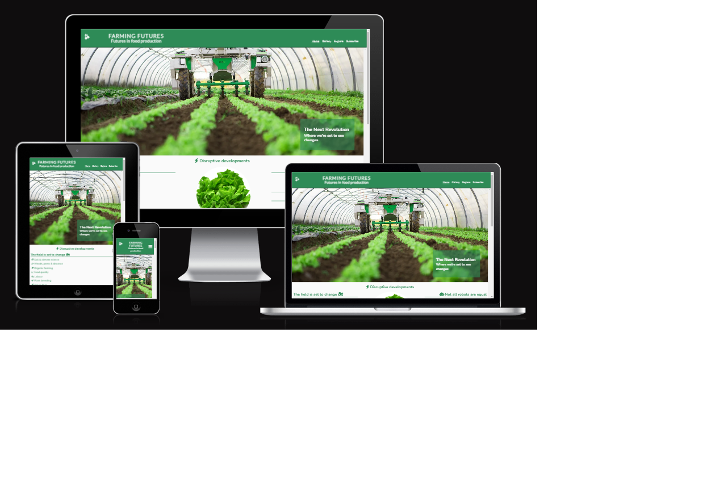

<base target="_blank">

# Farming Futures - An AI- and robotics-insired site showcasing future changes in agriculture

## Code Institute - First Milestone Project: Create a responsive, user-centred static website.

This website was developed to showcase my ability to design and create a static website.

## Introduction
This website was prepared for presentation as a first portfolio project for my online course in Full-Stack programming with Code Institute, based in Blackrock, Co. Dublin. I have interpreted the task as being to exhibit my ability to produce a simple website using almost exclusively html and css technologies. This includes a requirement to ensure that the website functions correctly and looks professional and complete, but as my course is not in creative web design, I have spent less time and effort on finer aesthetic questions. As the project will be judged according to the criteria set out in the relevant assessment guide contained in the Code Institute LMS, I have tried to be guided by that document.

TOC

## The website as it looks on-screen

### A live demo to the website can be found [here](https://jaimehyland.github.io/farming-futures/)

## User experience
Farming Futures is a website intended to attract, inform and inspire **professionals in the agricultural industry** (whether actually on the farm or producing goods and services for the industry) whose skills are not specialised in agricultural AI or robotics. It may also inspire **laypeople** with an interest in the future of agriculture. From the point of view of the **site owner** (a fictional Irish-based specialist charity going by the name of _Farming Futures_), the site is aimed at inspiring confidence among users in the owner body's professionalism and expertise on the relevant topics.

### User stories
As a user, I want to:
- understand the purpose of the website almost immediately upon visiting it;
- feel a positive emotional pull to the site and the topic it's dealing with;
- easily navigate this website (by using a mouse, a keyboard, or a touch screen);
- quickly get a feel for potential future changes in agriculture due to current developments in AI and robotic technology;
- be inspired, excited and concerned about such potential changes;
- find out where I can get more concrete information, both from Farming Futures and other sources;
- be able to sign up to either a hard copy or digital version of the site owner's newsletter;
- find out about relevant events related to AI and robotics in agriculture, especially in Ireland. 

As a user, I will not expect to:
- find detailed concrete or practical text-based technical or academic information within this site.

## Functional structure
### Initial structure
I have followed a paradigm in which the main content of the site is contained within the home page and in which the other pages on the site contain ancilliary information and services. This paradigm, however, is likely to change as the site further develops. The home page will likely shrink to become more like a simple attractive landing page and starting point for user exploration.

### Website pages
The site consists of:
1. **_Home page:_** The main page of the site, containing inspirational information and links to other parts of the site.
2. **_Gallery:_** A page showing additional inspirational images of AI and robotics in action in agriculture.
3. **_Subscribe:_** A page providing the user the opportunity to sign up to the site owner's (fictional) hard-copy or online newsletter.
4. **_Explore:_** A page providing links to outside information on robotics and AI in agriculture. It should be considered a non-academic reference page.
5. **_Imprimatur:_** A page accessible only via a link on the footer, giving the user basic information on the bodies and people legally responsible for the content of the website. It is excluded from the navigation menu on the header to prevent clutter.

### Page sections
Each page contains three sections:
1. **_Header:_** The header contains the main navigation functions. It is almost identical on each page, though the home page includes an anchor menu to help the user explore the various sections within the page.
2. **_Content:_** Contains the main content of the page. This section is most substantial on the home page, which contains several subsections.
3. **_Footer:_** Contains links to the site-owner's (fictional) social media accounts, and to the **imprimatur** page. The footer is identical on all pages.

## Technical structure
### Skeleton and file storage
The website contains just two layers of files: the home page and its four direct children. All html files are located directly in the site's root directory.
All assets are contained in an assets subdirectory placed within the root directory, with style assets contained in the _assets/css subdirectory_, photographs (in webp format) in _assets/images_ and favicon assets in _assets/favicon_.

## Accessibility
### Images and alt texts
I have given all images used (other than merely decorative background images) a sr-readable alt text. 

### Colors
I have selected a plain dark green color (seagreen: #2e8b57) as the site's main background colour and an off-white for most texts. These two colours are reversed in several places on the site. I have chosen these colours to reflect the agricultural side of the topic. Pressure of time and my current ignorance of the finer points of aesthetic web design largely prevented me from using other tints or adopting a fully-fledged colour palette.

Throughout the website, font colours appear on sufficiently contrasting backgrounds. the addition of semi-opaque background colours are overlaid overbackground images to absolutely ensure readibility.

### Background images
I used background images in several places on the home page was well as on the subscribe page. I have ensured that all the text overlying the images is readable at various screen resolutions.

## Other features
I have implemented a number of other features, some of the most prominent being the following:

### Favicons
I created a primitive 960x960-px image using Microsoft Paint and converted it to the necessary favicon formats using https://favicon.io/favicon-converter/.

### Go-to-top button
All pages include a **go-to-top button**, which appears at bottom right, just above the footer as soon as the user has scrolled at least 100px. Where the information on the page is limited and/or when viewing on a screen size where no scrolling is necessary, the go-to-top button never appears.

### Unnecessary input fields hidden
In subscription screen I implemented a simple css-only function to keep non-essential postal address input fields hidden until clicking a radio button makes them relevant.

## Accessibility
I have given all images used (other than merely decorative background images) a sr-readable alt text. Throughout the website, font colours appear on sufficiently contrasting backgrounds, with the addition where necessary of semi-opaque background colours over background images.

## Responsiveness
My main approach to achieving responsiveness was simply to look at my code using Google Chrome on larger second PC screen with developer tools enabled, switching between emulated screen sizes and intervening by adjusting flex attributes or adding screen queries wherever it seemed necessary. I also used the https://www.rapidtables.com/  site to identify viewing window sizes too large to see with the Google developer inspection tool in use.

## Development & implementation environment, and deployment
All the code created during this project was written using gitpod.io, with version control using git, and deployed via github on a daily basis.

## Design, development & coding philosophy; approach to version control
### Wireframe
At the initial design stage I created a wireframe using Balsamiq software to provide a starting point for my development work. It provided a low-resolution first approximation of the appearance and structure of the website as seen on a mobile device. All deviations from the original design were based on the learning experience during work on the project. I did not update the wireframe to reflect deviations from it that accumulated during my development work.

My original wireframe design can be found here (in pdf format): (./documentation/wireFrame.pdf)

### Sequence of coding steps
The code was written on a section-by-section according to "mobile-first" principle, only building screen-query-based responsiveness into the product once the broad lines of the app were built and tested on the Galaxy-S8 emulator provided by Google. If I were to do the job again, I might well change my approach. I provide more details in the "Lessons learnt" section below.

### Commits
I committed new changes relatively often (between once and a dozen time a day), and tried to keep a certain thematic logic to the changes included in each commit, but I did make some minor changes "on the fly" as I encountered them, sometimes not mentioning them at all in commit comments. However, I have tried to make sure such undocumented changes and bug fixes were limited to minor tweaks. I made pretty intensive use of the "git diff HEAD" command to check. I intend to add a step to this process the next time I'm working on a similar project (see One-person agile programming below).

### Minimising code clutter
I have tried to follow a "clean programming" paradigm in my work. I have therefore:
- not added code for any as-yet unimplemented functionalities (whether commented out or simply never called)
- deleted rather than commented out redundant lines of code
- avoided repetition in my css code as much as possible
Given that javascript programming is outside the scope of the project, quite a deal of cutting and pasting was required in my html code (for the almost identical headers and footers on each page, for example). This is a source of clutter, confusion and unnecessary work. It should be eliminated as far as possible and soon as possible in the future.

### ID vs class
In relation to the question of when to use the class attribute and when to use id to identify elements to style in the style.css file, I have preferred the class attribute unless the element in question is both unique in the relevant styling context and is likely to remain unique in new iterations of the site development process.

### Comments in code and order of appearance of css selectors on the style.css file
I have tried to err on the side of too many rather than too few comments in my code files, as the point in this case it to show the assessors that I understand what I'm doing, and not simply cutting and pasting code from elsewhere. In real-life programming would be far more terse. As is required in css code, I have tried to organise my selectors from generally applicable selectors to more particular ones, from homepage to linked pages (in order of appearance on the homepage menu), and within pages from left to right and from top to bottom. Selectors are separated by one blank line, while thematic groups of selectors are separated by two.

### Iterative deployment
Committed code was deployed via github on a daily basis.

## Testing
### Iterative testing, validation and troubleshooting - during ongoing development and before final submission.
The main browser against which my code was tested in an iterative process (running a smoke test before every commit at the very least) was the latest version of Google Chrome (using the development toolkit provided by Google). Near the end of the development process, I used my own Samsung Galaxy A7 (running on the latest version of Chrome), my ipod (running on the latest version of Safari), and my laptop, using the latest versions of Chrome, Microsoft Edge and Firefox. Owing to lack of time, I was unable to do any testing on any legacy versions of these or on any other browsers or machines, with the exception of an informal test on an iphone (version unknown) in dark mode using Safari.
Testing also included checking the images (including background images) on different screen sizes for unsightly pixilation.

### Final testing and validation before submission
All internal and external links were smoke-checked systematically before submitting the project for assessment.

I validated my html and css code regularly during development via direct input into the validation services provided by W3C at https://validator.w3.org/ and https://jigsaw.w3.org/css-validator/. My final code passes both validation tests.

## Lessons learnt
### Mobile first
The next time I do a similar project, I will continue follow the "mobile first" design paradigm, but in future I will embed that approach iteratively within the development of each section of the site. The effect of completing a round of coding for the whole site before switching to media-query-based coding was that I repeatedly needed reacquaint myself with the code in each section before beginning work on media-query-based changes. I hope in future that if I start work on the media-query-based selectors as soon as I finish the basic styling for each section, the code for that section will still be fresh in my mind, thus saving me time and effort.

### One-person agile programming
Another lesson I have learnt is that immediately following each push, I should hold a mini "stand-up" meeting with myself to identify the tasks to be completed before the next commit. 

### Time management
When faced with the inevitable coding challenges of a beginner coder, I could sometimes have managed my time a little better. I often spent too long on bugs without looking for help. In addition, some of my decisions on pages and features to be included were over-ambitious.

## Lessons not (yet) learned
One issue I haven't had yet time to research is the implications of differing user interactions on touchscreens as opposed to desktop and laptop screens. As a result, some of the icons do not respond to user interaction in as elegant a manner as I would have hoped on starting out on this little adventure. This is a deficit I need to remedy.

## What doesn't work
### ... because it's outside the scope of project
Some functionality is incomplete in the project, especially the following:
- Social media links are to the home pages of the respective media.
- No account exists for the e-mail link that appears on the imprimatur page.
- All addresses are fictional.
- Form data entered via the site is sent to code institute's test environment rather than being collected and saved.
 - The 'required' functionality for the postal address section of the subscription page has not been implemented because there appears to be no easy way to remove the required attribute from hidden data input fields using purely html and css.
- The traditional splashscreen to conform with EU GPDR regulations is unnecessary, as no data is being collected in reality.
- Various other functionalities requiring javascript have not been implemented as the site is designed to use effectively exclusively html and css technologies, for example, the menus should really disappear when the user selects an item on them or taps/clicks anywhere else on the screen (as this is done most effectively using javascript, I have postponed implementing this and similar functionalities until I have learnt a little javascript).

### ... for lack of time, skill and/or data
Pressure of time and my current ignorance of the finer points of aesthetic web design has meant that:
- I haven't been able to use a range of tints, much less adopt and implement a fully-fledged colour palette.
- I'm not very happy with basic design of the various favicon images I created (see Favicons). I deployed them anyway to demonstrate that I understand how to deal with such images ... and because the colours at least match the site. If I had my time over, I would have used a simpler, more iconic image.
- I would like to have implemented one or two more features based on css-only modal dialogs, especially in the 'Breakthroughs' section of the main page.
- I would have liked to implement interactivity with the events, providing the user with routing information for upcoming events on selection, and perhaps showing the user images of events in the past.
- I originally intended to hide the top-left anchor link on the home page for larger screen sizes, and instead to recode the <ins>Home</ins> link on the menu to make it show the anchor menu there instead. That change too will have to wait.

Two pages that I originally hoped to include in my project (i.e. "The Present" and "The Future" pages) have disappeared from my project for reasons of time. 

Also due to lack of time, some individual pictures have appeared in several places on the site (though never on the same page ... I hope!!). Some of the pictures used as background images appear once more in the gallery. I would rarely allow that on a real-life website.

Aside from all that, I have included fictional references on the 'Explore' page that simply link to Wikipedia entries. For all the respect I have for Wikipedia, I doubt it would often make sense for a specialist reference webpage to provide links to Wikipedia. In a real-life situation, online references would usually contain genuine external links to an authoritative and/or professional source.

Finally, the footer on each page doesn't look quite right if the main section above it is too small to require scrolling. This is due to the wrong value for the length of the main section being calculated in the code used to implement the 'back to top' button. I have worked around this issue by ensuring that scrolling is necessary on all common screen sizes (except in the case of the gallery, which still shows the problem). Repairing this issue would be my first step in any future development of the site.

## Credits and sources
### Code institute's own resources
Almost all the code is my own, though much of it either follows closely or takes direct lessons from the code created by Jo Heyndels for the 'Love Running' walkthrough project and/or Anne Greaves' 'Coders Coffeehouse' site. Many thanks are due to both Jo and Anne for their beautiful static websites, their clear instructions and high-quality learning material. I have included an appropriate comment beside the one or two snippets of code directly copied from Jo's walkthrough project. Implicit thanks go to everyone involved in authoring the Code Institute learning materials for this part of the course.

### External technical sources
Naturally enough, have researched widely to find out how to implement a variety of features not explicitly included in Code Institute's learning materials, including several visits to the following sites:
- https://w3schools.com/
- https://stackoverflow.com/
- https://www.freecodecamp.org/
- https://www.bestcolleges.com/
- https://css-tricks.com/
- https://developer.mozilla.org/
- https://www.codecademy.com/

However, the only external source from which I directly copied was freecodecamp.org, from which I more or less directly copied the back-to-top button functionality (https://www.freecodecamp.org/news/css-only-back-to-top-button/). The place where I copied that code is therefore the only place in my project I have marked any code as being other than my own (though this approach probably does an injustice to Jo).

### Acknowledgements for images used
With the exception of the very rough and ready set of favicon files that I cobbled together, none of the images used on this project were original to me. I have provided acknowlegements for each of the images individually below.

| Page | Image | Usage | Original URL | Site owner |
|................|................|................|................|................|
|................|................|................|................|................|
|................|................|................|................|................|
|................|................|................|................|................|
|................|................|................|................|................|

### Personal thanks
Apart from Jo and Anne and the authors of the various online resources I used, I owe special thanks to the following people:
- My mentor, Oluwafemi Medale, for being available every time I needed him, and for providing high-quality, relevant and timely advice;
- David Calikes of Code Institute's student welfare service, who provided encouragement when it mattered and who gave more than a few practical tips in the run up
- Code Institute's tutoring team, whose help I probably didn't lean on as much as I should have, and whose time I am determined to infringe on much more intensely in the run-up to my next deadline;
- My family, for putting up with my absences, frequent cries of anguish and occasional roars of triumph.

## todo
- add some external links (on new browser tab)
- add video
- add tooltip to anchor icon
- add an iframe
- add screenshots and feature explanations to readme
- create links on readme and ensure that they work
- check for excessive blank lines in css and html
- complete comments in code
- check attribute names and values for consistency, conformity and logic
- check for correct use of ids and classes
- check headers and footers for function and consistency on each page
- implement main sections on gallery and explore pages
