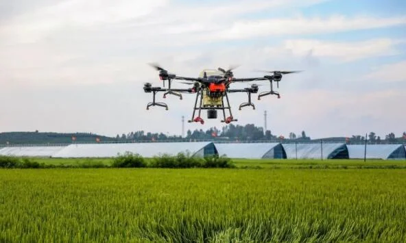

<base target="_blank">

# Explore this short selection of resources on the future of farming

## Introductory reading material
Reading University provides an excellent article discussing the possible positive and negative effects of the fourth agricultural revolution that now happening all over the world due to new technology in data science, artificial intelligence and robotics.

Check out this interesting [article](https://www.techtarget.com/searchenterpriseai/feature/AI-examples-that-can-be-used-effectively-in-agriculture) by [Lisa Morgan](https://www.techtarget.com/contributor/Lisa-Morgan) of Techttarget.com, in which she lists some real-world applications of AI and machine learning in agriculture.

https://aiforgood.itu.int/agricultural-robots-farming-smarter-not-harder/

## News on new developments

[foodnavigator.com/](https://www.foodnavigator.com/), an specialist online news site publishes frequent articles [(like this one)](https://www.foodnavigator.com/Article/2019/01/04/Our-world-is-entering-a-fourth-agricultural-revolution-says-UK-environment-secretary#) on new technology in architecture.

https://www.robotics247.com/

## Sound and vision

From the popular Interesting Engineering YouTube channel. Robots of all shapes and sizes in action in all sorts of agricultural scenarios. 

Check out this selection of agricultural robots already being used in the fields put together by Kinetic Tech, also on Youtube.
https://www.youtube.com/watch?v=ntDGqWv5KBk

[This fascinating video](https://www.youtube.com/watch?v=I0PCSH2n8YU) from AHDB Horticulture opens with a fascinating machine in use in the Netherlands that combines visual machine learning with highly advanced manipulation robotics to select cuttings and place them correctly in their rooting medium. What follows is a demo of more traditional robotics extremely widely used in the most modern horticultural industry in the world.

This podcast is interesting.

## Enterprises working in the sector

[agritecture.com](https://www.agritecture.com/) is a mid-sized actor in the promotion of and in education on 'climate-smart agriculture' specialising in urban and controlled environment food production. Their [blog feed](https://www.agritecture.com/blog-feed) is full of interesting insights into the fast-developing sector.

## Educational opportunities in Ireland

University College Galway offers an on-campus 1-year fulltime [MSc in Computer Science and Artificial Intelligence](https://www.universityofgalway.ie/courses/taught-postgraduate-courses/computer-science-artificial-intelligence.html).

[University of Limerick](https://www.ul.ie/) offers a variety of undergraduate and post-graduate courses in the relevant disciplines. Check out in particular its [MSc course in Artificial Intelligence & Machine Learning](https://www.ul.ie/gps/artificial-intelligence-machine-learning-msc) and its [MEng in Computer Vision and Artificial Intelligence](https://www.ul.ie/gps/courses/computer-vision-and-artificial-intelligence-meng)

[South East Technological University](https://www.setu.ie/) offers an MSc course in [Applied Artificial Intelligence](https://www.itcarlow.ie/study/postgraduate-rd/postgraduate-programmes-taught/computing-data-science/master-applied-artificial-intelligence.htm) and an [organic and biological agricultural crop-management](https://www.wit.ie/courses/certificate-in-crop-management-in-organic-and-biological-agriculture), both full-time courses taught on campus. 

## Robot developers and manufacturers
Among other high-tech activities [Agrobot](https://www.agrobot.com/), has had huge success in building and selling robots for strawberry harvesting.
Agricultural scouting drones are among the specialties of [American Robotics](https://www.american-robotics.com/).
https://www.bearflagrobotics.com/ specialises in autonomous tractors. Interestingly, it was recently purchased outright by [John Deere](https://www.deere.com/en/)!
Operating mainly in extensive agriculture sector in North America, [Blue River Technology](https://bluerivertechnology.com/) specialises in precision spraying technologies.
[Abundant Robots](https://www.linkedin.com/company/abundant-robots/about/) specialises in using three-D visual machine learning with highly specialised robots to harvest and sort apples automatically.
LIke them, [Ecorobotix](https://ecorobotix.com/en/) also works on highly precise crop treatment delivery systems.
[Small Robot Company](https://www.smallrobotcompany.com/), as the name suggests, makes a wide variety of small robots for an extensive range of jobs around the farm. For both extensive and intensive agriculture.
[Soft Robotics](https://www.softroboticsinc.com/) concentrates on visual machine learning and vision systems --- as well as in the highly specialised grippers and that use such systems to see what they're doing.